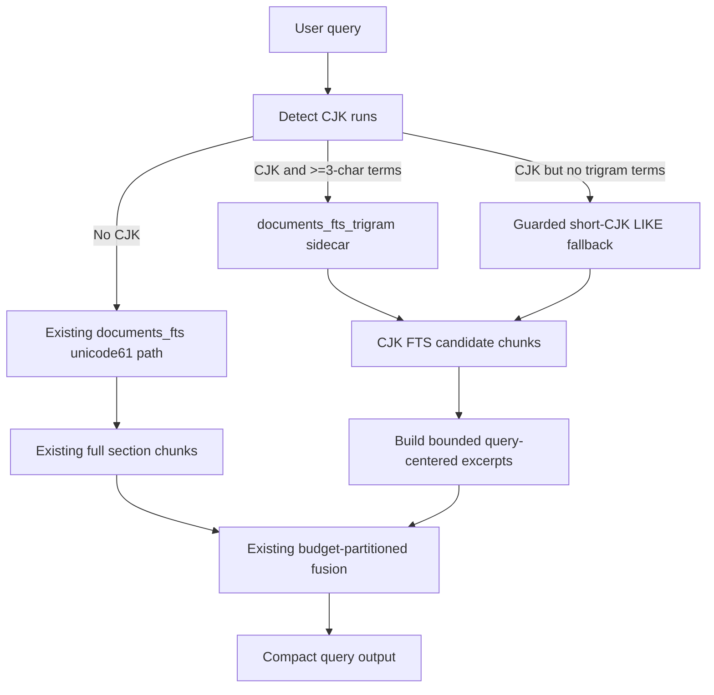

# CJK Trigram FTS Design

Status: implemented and eval-verified — 24/26 (q12 HIT, no regression vs the 23/26 shipped baseline; remaining misses q08/q19 are pre-existing budget/ranking tradeoffs)
Date: 2026-06-11
Scope: q12-class CJK recall failures after graph + FTS fusion

## Summary

Membox adds a CJK-specific FTS path instead of replacing the existing
English-oriented `documents_fts` table. The implemented design is:

- Keep `documents_fts` unchanged for the current `unicode61` English/mixed
  retrieval path.
- Add a sidecar `documents_fts_trigram` external-content FTS5 table using
  `tokenize='trigram'` and `detail=none`.
- Route queries containing CJK text through a CJK chunk candidate path that uses
  3-character n-gram MATCH expressions.
- Render CJK FTS results as bounded excerpts instead of full section chunks, so
  answer-bearing sections larger than the default 2000-token budget can still be
  admitted.
- Use a guarded `LIKE` fallback only for short CJK queries that cannot produce a
  3-character trigram term.

This keeps pure-English retrieval behavior stable while fixing the structural
blind spot that caused q12 to return 0 FTS rows.

## Problem

The current direct FTS path uses SQLite FTS5's default `unicode61` tokenizer and
`_fts5_or_query(query)`.

That works for whitespace-separated English questions, but not for
whitespace-free Chinese questions:

- `unicode61` treats a continuous Chinese sentence as one long token.
- `_fts5_or_query()` splits on whitespace, so a Chinese question like
  `玲珑命理项目中苏轼八字案例的命格名是什么？` becomes one quoted MATCH expression.
- The current eval DB returns 0 rows for q12 even though the corpus contains
  `癸水七杀格`.

Local verification on `/tmp/membox-eval-gemini3.db` also showed a second issue:
with a temporary trigram table, q12's answer-bearing document becomes a
candidate, but the full `Current state` section is roughly 2840 estimated tokens.
It cannot be emitted under the default 2000-token budget if FTS still renders
whole section chunks. CJK recall therefore needs both candidate generation and
budget-sized excerpts.

## SQLite Facts

SQLite's FTS5 documentation defines `unicode61` as the default tokenizer and
states that it creates tokens from contiguous runs of Unicode letter/number
characters. For Chinese text without spaces, that means long token runs.

The same documentation defines the built-in trigram tokenizer as indexing each
contiguous sequence of three characters and supporting substring matching:
<https://sqlite.org/fts5.html#the_trigram_tokenizer>.

Important constraints from SQLite's trigram behavior:

- Full-text queries shorter than three Unicode characters do not match rows.
- With `detail=none`, full-text query tokens must be no longer than three
  Unicode characters. This is acceptable if the CJK query builder emits only
  3-character terms.
- Keeping trigram as a sidecar index avoids changing BM25 behavior for the
  existing English path.

## Recommended Architecture

The graph + FTS fusion layer remains unchanged conceptually: graph triples and
FTS chunks still have separate ranking semantics, and fusion still happens at
the token-budget layer. The CJK path only changes how FTS chunk candidates are
generated and how their content is sized before admission.

## Data Model

Add migration v5:

- Create `documents_fts_trigram` as an external-content FTS5 table over
  `documents(content)`.
- Use `tokenize='trigram'`.
- Use `detail=none` to reduce index size; the query builder must emit only
  3-character MATCH terms.
- Add separate insert/update/delete triggers for the sidecar table instead of
  modifying the existing `documents_fts` triggers in place.
- Backfill existing `documents` rows into the sidecar.

The existing `documents_fts` table remains the source of truth for non-CJK FTS
retrieval. If the sidecar table is missing, old databases continue to fall back
to the existing unicode61 path.

## Query Construction

Keep `_fts5_or_query()` unchanged for the existing unicode61 path.

Add a CJK-specific query builder:

- Detect CJK runs using a Unicode range check.
- For each CJK run with length at least 3, emit ordered unique 3-character
  windows.
- Escape each term as an FTS5-safe quoted token and join terms with `OR`.
- Cap the number of terms to keep MATCH expressions bounded for long questions.
- Return no trigram MATCH expression when all CJK runs are shorter than three
  characters.

Short CJK fallback:

- If the query contains CJK but no 3-character terms, use a guarded
  `documents.content LIKE ?` fallback for 1-2 character CJK terms.
- This is intentionally a last resort because it can be a linear scan. It should
  respect `project_filter`, over-fetch only enough rows to fill
  `fts_fallback_k`, and rank by deterministic term-hit count plus existing
  document tie-breakers.

## CJK FTS Excerpts

For CJK FTS results, return excerpts instead of whole section chunks.

Reason: q12's answer-bearing `Current state` chunk is larger than the default
2000-token budget. Candidate recall alone would still lose during budget
admission.

Excerpt rules:

- Excerpting applies only to the CJK sidecar/short-CJK fallback path in the
  first implementation. Pure-English FTS output stays unchanged.
- Build anchor terms from query-derived CJK 2-, 3-, and 4-character windows.
  Two-character terms are used for excerpt anchoring only, not trigram MATCH.
- Select up to two non-overlapping windows per document, each with a fixed token
  ceiling.
- Score candidate windows by local density of focus-query anchor terms, then
  render selected windows in original document order. For question shapes like
  `...项目中X是什么`, reranking and excerpting use the focus span `X` while
  trigram recall still uses the full query.
- Prefix excerpted output with the same provenance tag format and an additional
  marker such as `excerpt` so users can distinguish it from a full section
  chunk.
- If the full chunk already fits the remaining CJK chunk budget, the renderer
  may keep the full chunk. If not, it uses excerpts.

This is deliberately query-time excerpting. It does not require re-ingesting old
databases and does not change markdown section chunking.

## Retrieval Integration

`fts_fallback_chunks()` should become a small dispatcher:

- Non-CJK query: current `documents_fts` query and current full-chunk behavior.
- CJK query with trigram terms and sidecar table present:
  `documents_fts_trigram` query, BM25 order within that sidecar, version
  deduplication, CJK excerpt content.
- CJK query without trigram terms: guarded short-CJK fallback, version
  deduplication, CJK excerpt content.
- CJK query with sidecar unavailable: current unicode61 fallback, preserving
  old behavior.

`_bm25_scores_for_relations()` should use the same table-selection rule for CJK
queries when scoring graph triple evidence. This keeps lexical graph scoring and
direct FTS candidates aligned.

The public CLI does not need a new option. Existing controls still apply:

- `retrieval.fts_fallback_k`: candidate cap.
- `retrieval.chunk_share`: FTS budget reservation in merge mode.
- `retrieval.budget`: total output budget.
- `fusion_mode="fallback"`: compatibility behavior.

## Rejected Alternatives

### Replace `documents_fts` with trigram

Rejected for v1. It is simpler structurally, but it changes English BM25 ranking
for every query and makes rollback harder. The current shipped defaults already
pass the quality gate for English-heavy queries, so the CJK fix should not
disturb that path.

### Use only LIKE

Rejected as the primary path. It handles 1-2 character CJK terms, but it does not
scale as the main search path and provides weaker ranking than FTS5 BM25. It is
acceptable only as a guarded fallback when no trigram terms can be generated.

### Use a jieba-style Chinese segmenter

Deferred as a comparison option, not shipped in this slice. A Python segmenter
can be useful, but it cannot plug directly into SQLite FTS5 as a tokenizer
without a native extension. The practical local implementation would be another
sidecar table containing pre-segmented Chinese text, indexed by `unicode61`.
That adds a runtime dependency, dictionary/version behavior, and custom-word
maintenance for project names and code symbols. It also does not remove the
need for query-time excerpts: q12's answer-bearing section is larger than the
default 2000-token budget. The trigram sidecar is dependency-free and SQLite
built-in, so it is the default implementation; jieba-style segmentation remains
a future A/B candidate if Chinese-heavy corpora justify the extra dependency.

### Re-ingest with smaller markdown chunks

Rejected as the main fix. Smaller chunks may help future corpora, but it does
not repair existing databases without a re-ingest. Query-time CJK excerpts solve
the current DB and future oversized chunks with less operational cost.

## Implementation Slice

Implement this as one runtime slice, not as separate partial phases:

1. Add the sidecar migration and triggers.
2. Add CJK query construction helpers.
3. Add CJK sidecar candidate retrieval and short-CJK fallback.
4. Add CJK excerpt rendering for FTS chunks.
5. Apply the CJK table-selection rule to relation BM25 scoring.
6. Update design/spec/handoff docs with measured results.

These pieces should ship together because sidecar recall without excerpting may
still miss q12 under the default budget.

## Verification

Automated tests:

- Migration creates `documents_fts_trigram` and keeps it synchronized on
  document insert/update/delete.
- CJK query builder emits 3-character OR terms for whitespace-free Chinese and
  emits no trigram expression for 1-2 character-only queries.
- Trigram sidecar returns a Chinese document for a Chinese natural-language
  question that `unicode61` misses.
- Short-CJK fallback returns a document for a two-character name query.
- CJK FTS output uses bounded excerpts and can admit an oversized answer-bearing
  section under a 2000-token budget.
- English FTS fallback ordering remains unchanged.
- `fusion_mode="fallback"` and `fts_fallback_k=0` preserve their documented
  behavior.

Manual eval gates:

- Re-run q12 against `/tmp/membox-eval-gemini3.db`; expected result: q12 becomes
  HIT under the default 2000-token budget.
- Re-run the full 26-question Gemini eval; required result: no regression from
  shipped 23/26, temporal remains 4/4, multi-hop remains at least 6/7, mean
  output stays within the default budget contract.
- Inspect q08/q19 to confirm CJK changes do not alter pure-English miss
  attribution.

### Measured results (2026-06-11)

- Full 26-question Gemini eval on a re-ingested copy of the gemini3 DB:
  initial run 23/26 with q12 still MISS — trigram recall found the answer
  chunk, but raw anchor-density reranking placed it 3rd and a redundant second
  excerpt window bloated it past budget admission.
- Two follow-up fixes inside the CJK path only: maximal-term scoring in
  `_cjk_content_score` (a matched n-gram subsumed by a longer matched n-gram
  no longer double-counts) and a marginal-gain gate on extra excerpt windows
  (an additional window must add a new anchor term or carry at least half the
  best window's anchor weight).
- Final verified result on the post-eval DB at budget 2000: **24/26 — q12
  HIT, all 23 baseline HITs preserved, temporal 4/4, multi-hop 6/7**.
  Remaining misses q08/q19 are the pre-existing English budget/ranking
  tradeoffs. q12 also verified HIT on a fresh pre-re-ingest gemini3 copy.

## Rollback

The sidecar table is additive. If the CJK path causes regressions, code can stop
querying `documents_fts_trigram` and the existing unicode61 path remains intact.
The sidecar table and triggers may stay in the DB harmlessly until a later
cleanup migration is explicitly approved.
