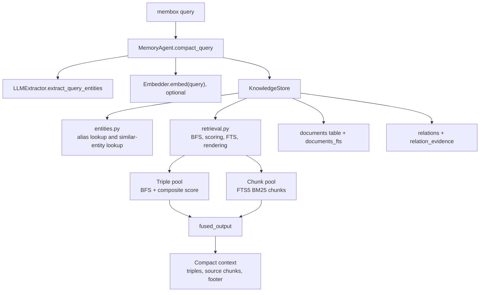
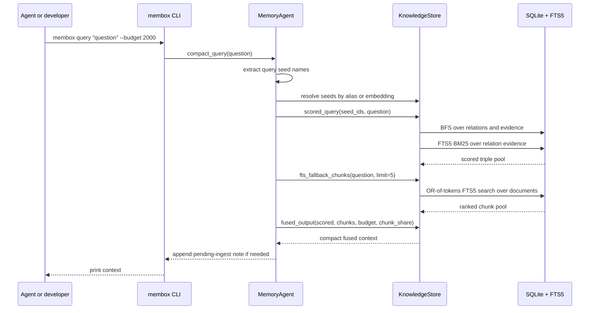
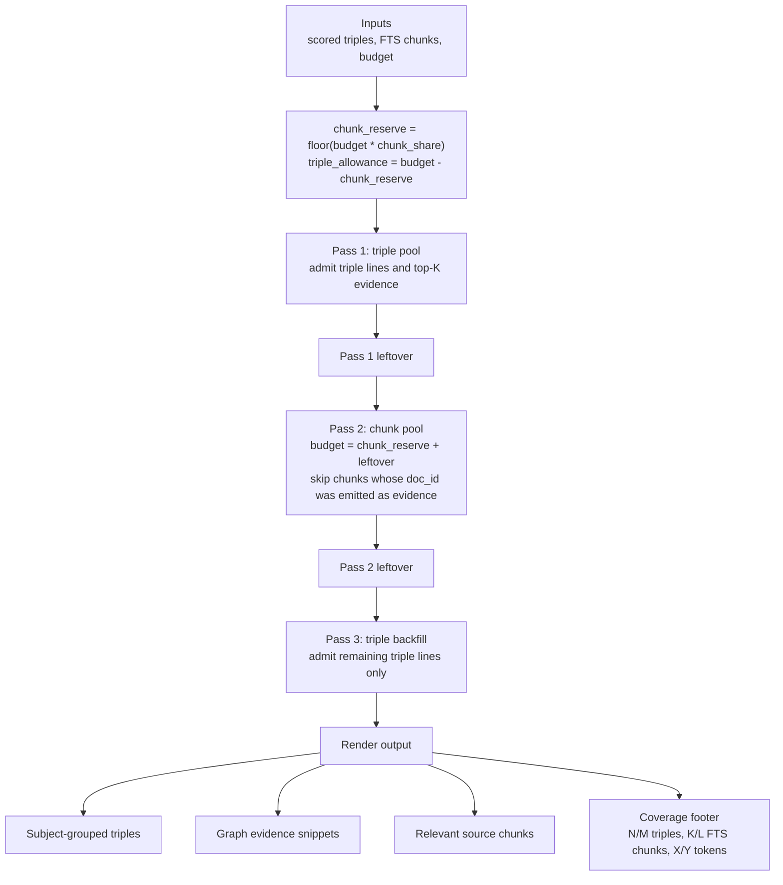
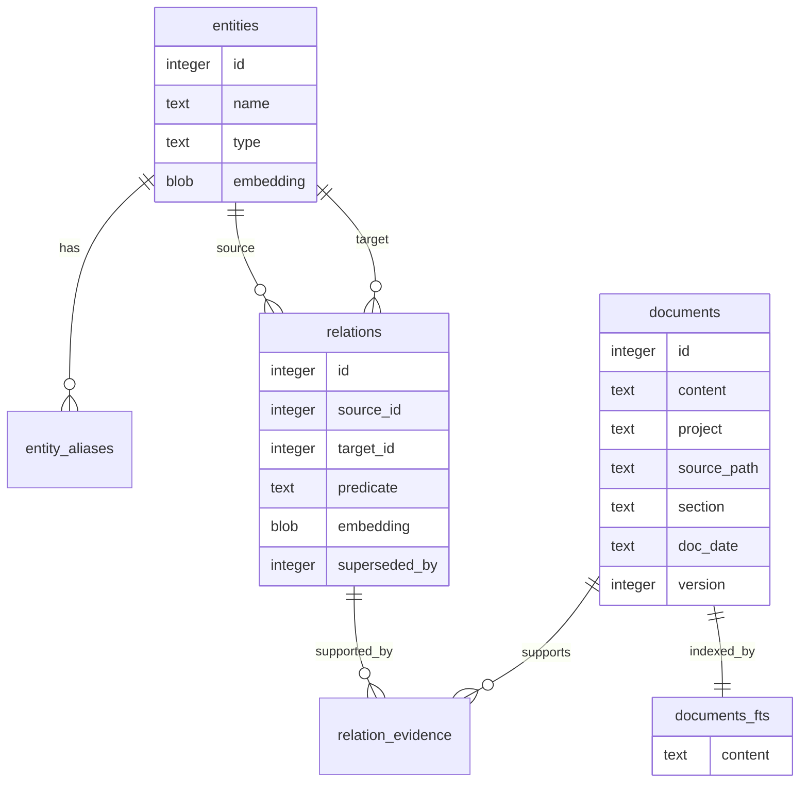
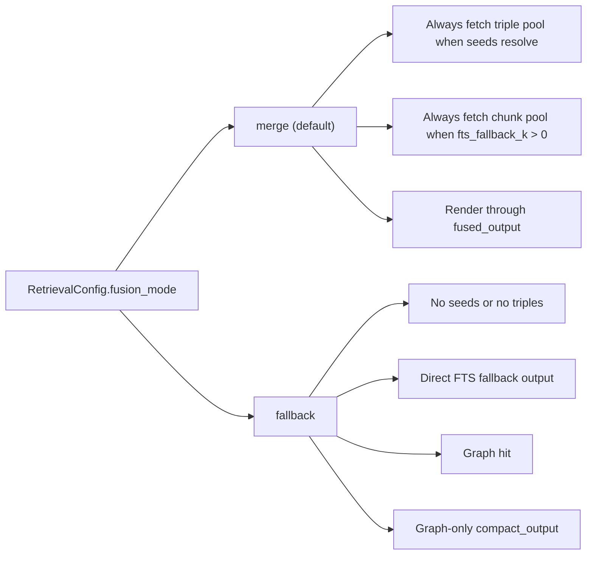

# Retrieval Architecture and Data Flow

Status: current after graph + FTS fusion
Date: 2026-06-11

This document explains the read-path architecture that powers `membox query`.
It focuses on the default budget-partitioned graph + FTS fusion path and the
fallback compatibility mode kept for A/B testing.

## Component Architecture

The extractor may use a chat model to identify seed entities. Fusion, scoring,
budgeting, and rendering do not add any LLM calls. If no extractor or embedder
is available, retrieval still works through aliases, exact names, graph edges,
and FTS chunks.

## Default Query Data Flow

## Fusion Renderer

The renderer uses skip-and-continue admission. Oversized items are skipped
instead of stopping the pass, so later cheaper items can still fit.

## Storage Surfaces Used by Retrieval

## Control Modes

Use `fusion_mode="fallback"` only for A/B comparison, regression diagnosis, and
rollback. The default product behavior is `fusion_mode="merge"`.

## Acceptance Snapshot

The shipped Gemini defaults (`fusion_mode="merge"`, `chunk_share=0.4`,
`fts_fallback_k=10`) reached:

- Overall: 23/26, 88.5%.
- Single-hop: 13/15, 86.7%.
- Multi-hop: 6/7, 85.7%.
- Temporal: 4/4, 100%.
- Mean output: 1941 estimated tokens.

The acceptance threshold was overall >= 80%, temporal 100%, multi-hop at least
4/7, and default 2000-token budget.
